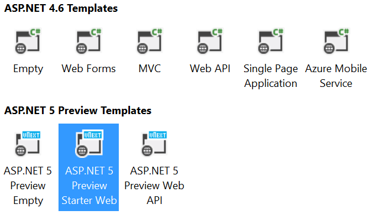
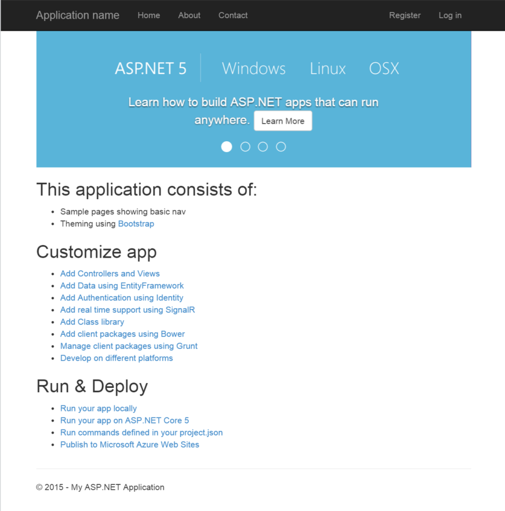
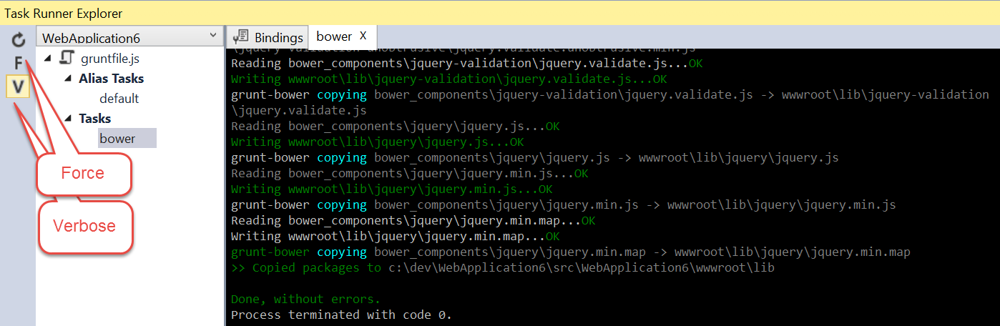
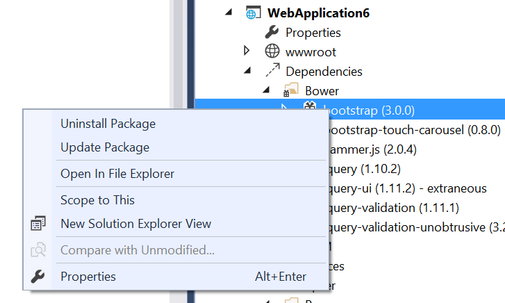

# Improvements in Visual Studio for Web Developers and ASP.NET 5 Updates for February 2015 #

It's time for another Visual Studio 2015 CTP, and with the CTP 6 release in February 2015 you should find a number of enjoyable improvements that every web developer will enjoy.  In this article, we'll review the new features and improvements in ASP.NET 5 and the Visual Studio editor improvements delivered in CTP 6.

## New Project Templates ##

We've organized the New ASP.NET Project dialog a bit.  Now, when you want to start a new ASP.NET 5 project, you start by selecting 'File - New Project - Web - ASP.NET Web Application' and the below set of project templates are displayed.

Notice that we have added a grouping for the ASP.NET 4.6 templates that you're probably already familiar with, and the new ASP.NET 5 preview templates.  We hope this makes it easier to discern which templates are new in this version and which templates are those you've been working with previously.

The Starter Web template has been updated with information about how to get started building ASP.NET applications that can run on Windows, Linux, and OSX.  The home page now shows a bootstrap carousel with information about this and a whole lot more:

The new Web API template is introduced in this release, and it omits all of the extra HTML and razor markup that MVC provides so that you can focus on simply writing a solid API.  Start here if you want to build an API with static content, or even as a starting point for your next single-page-application.

## Task Runner Explorer ##

For JavaScript developers and automation of tasks, the task runner explorer has received a design update.  We've moved the toolbar from the top to the left side and introduced some new buttons.

The new buttons allow you to refresh the contents of the current file, troggle the force flag when running a task, and toggle the verbose flag for a task.  In the sample image, we've enabled verbose reporting for executing the grunt-bower task in a default ASP.NET project.

## Grunt, Bower, npm and Gulp  

There are some new updates in the editor for parsing and managing grunt, gulp, bower, and npm configuration files.  We are now providing better intellisense support for these file formats as well as enforcing JSON schemas for those tools.  With the addition of byte-order-mark processing in these files, you should have no problems transporting them between Windows, Linux, and OSX operating systems.

If you're like me, you hated having to re-run grunt or gulp tasks each time you changed npm or bower configurations.  The project.json file had automatic restore built in for NuGet, so why can't we have it for bower and npm?  Yes... yes you can now have it for bower.json and package.json too.  Each time you save these files, we will restore new packages immediately in the background for you.

We know that developers enjoy working with the solution explorer.  We've made it easier to update and uninstall bower and npm packages in that panel with a pair of new context menu options:

We placed these options where it made sense for developers who have been using Visual Studio for a long time, and are used to being able to remove references from their projects with some mouse gestures in their solution explorer.  

## Security Updates

< to come from Vittorio >

## Summary

Keep an eye on our Web Development and Tools blog this week as we have a number of articles planned that take a deeper dive on each of these topics.  Do you like what you see?  Are these improvements going to help you as a web developer?  Write back to us in the comments below... we read all of them, and if you're lucky your feature suggestions will make it into the next release of Visual Studio.